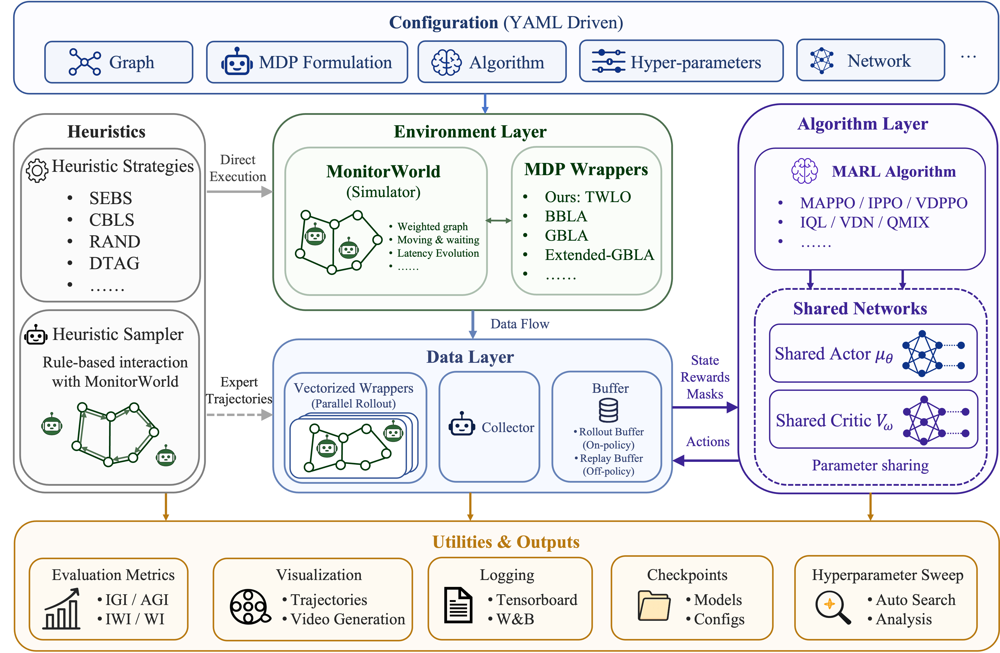

# M2Bench

<p align="center">
  
</p>

**A unified benchmark for multi-robot persistent monitoring on weighted graphs**

[English](README.md) | [简体中文](README_zh-CN.md) | [User Guide](USER_GUIDE.md) | [Paper](https://arxiv.org/abs/2605.09633v2)

M2Bench is the research codebase accompanying *Minimizing Worst-Case Weighted Latency for Multi-Robot Persistent Monitoring: Theory and RL-Based Solutions*. It provides a common graph simulator, training pipeline, and evaluation protocol for classical patrolling heuristics, tabular reinforcement learning, deep RL, and cooperative MARL.

The paper calls our proposed formulation the **Tail Worst-case Latency-Optimizing MDP (TWLO-MDP)**. The implementation predates that name, so its Python modules, registry key, and YAML paths still use the historical identifier `masup`. Throughout the documentation, **TWLO** denotes this same implementation; literal commands retain `masup` where required by the code.

## Highlights

- Continuous travel time on weighted graphs with fixed-step and event-driven simulation.
- Priority-weighted monitoring metrics: IGI, AGI, IWI, WI, and TWLO's post-transient worst latency.
- A shared interface for PettingZoo-style multi-agent environments and Gymnasium joint environments.
- Reusable single-agent actor/value policies assembled through independent or parameter-shared policy mapping.
- On-policy, off-policy, recurrent, tabular, graph-network, imitation-initialized, and W&B sweep workflows.
- Unified evaluation and visualization for learned and heuristic policies.

## Installation

The reference environment targets Linux x86-64, Python 3.10, PyTorch 2.6, and CUDA 12.4. A CUDA-capable GPU is recommended for neural training; heuristic and tabular experiments can run on CPU.

```bash
git clone https://github.com/SpikeW726/M2Bench.git
cd M2Bench
conda env create -f environment.yml
conda activate M2Bench
```

Verify the core installation:

```bash
python -c "import torch, gymnasium, pettingzoo, wandb; print(torch.__version__, torch.cuda.is_available())"
```

`environment.yml` is the reproducible environment definition. `requirements-pip.txt` is an exported package snapshot and may contain platform-specific build paths, so it is not the recommended installation entry point.

Weights & Biases is optional for a normal run when `track_wandb: false`, but is required for sweeps:

```bash
wandb login
```

## Quick Start

Run commands from the repository root. Existing YAML files under `configs/` are complete experiment specifications.

### Train a policy

```bash
python train.py configs/experiments/masup/mappo_masup_grid_a3.yaml
```

Checkpoints are written to `models/<algorithm>-<environment>-<graph>/<timestamp>/` by default. Override checkpoint and automatic-evaluation roots without editing YAML:

```bash
python train.py configs/experiments/masup/mappo_masup_grid_a3.yaml \
  --save-dir /path/to/checkpoint \
  --results-dir /path/to/results
```

The supplied experiment configurations reproduce full training runs and may use tens of millions of environment steps. For a smoke test, copy a configuration and reduce `training.total_steps`, `training.num_envs`, and `training.num_steps`.

### Evaluate a learned policy

Pass the checkpoint directory containing `config.yaml` and `policy.pt`:

```bash
python evaluators/test.py \
  --model models/mappo-masup-grid/<timestamp>/best \
  --env_config configs/eval/masup/masup_grid_a3.yaml \
  --num_episodes 10 \
  --no_show
```

Evaluation figures and CSV data are saved under `evaluators/results/` unless `--save_plot` or `--results-dir` is supplied.

### Evaluate a heuristic

The positional arguments are map, number of robots, and episode horizon:

```bash
python evaluators/heuristic_evaluator.py island 6 500 \
  --policy HCR \
  --init-positions 0 10 20 30 40 49 \
  --num_episodes 10 \
  --no_show
```

Initial positions are graph node IDs, not ordinal positions in the node list. Omit `--init-positions` for random starts.

### Run a sweep

```bash
python sweep.py \
  --base-config configs/experiments/masup/mappo_masup_grid_a3.yaml \
  --sweep-config configs/sweep/masup/mappo_masup_grid_a3.yaml \
  --count 20
```

See the [User Guide](USER_GUIDE.md) for configuration semantics, evaluation options, implemented methods, references, and extension procedures.

## Repository Layout

```text
algorithms/             RL, MARL, and tabular optimization algorithms
configs/                Dataclasses, registries, and experiment/eval/sweep YAMLs
data/                   Rollout batches and replay buffers
envs/                   Vector environments and monitoring MDPs
evaluators/             Learned-policy and heuristic evaluation tools
graphs/                 Weighted monitoring graphs and display coordinates
networks/               MLP, recurrent, graph, MAT, and TWLO-specific networks
policies/               Reusable RL policy wrappers and heuristic controllers
trainers/               On/off-policy, tabular, and imitation workflows
utils/                  Graph, logging, checkpoint, upload, and sweep utilities
train.py                Main training entry point
sweep.py                Weights & Biases sweep entry point
run_all_heuristics.py   Batch heuristic evaluation
```

The central registries in `configs/registry.py` connect YAML identifiers to environments, networks, algorithms, and trainers. Checkpoints store both network reconstruction metadata and weights, allowing `evaluators/test.py` to rebuild a trained policy without importing its original experiment YAML.

## Citation

If you use M2Bench or the TWLO formulation, please cite:

```bibtex
@article{wang2026minimizing,
  title={Minimizing Worst-Case Weighted Latency for Multi-Robot Persistent Monitoring: Theory and RL-Based Solutions},
  author={Wang, Weizhen and Wang, Ziheng and He, Jianping and Guan, Xinping and Duan, Xiaoming},
  journal={arXiv preprint arXiv:2605.09633},
  year={2026}
}
```

When reporting a baseline reproduced by this repository, please also cite the corresponding original work listed in the [implemented-method tables](USER_GUIDE.md#implemented-monitoring-mdps).
